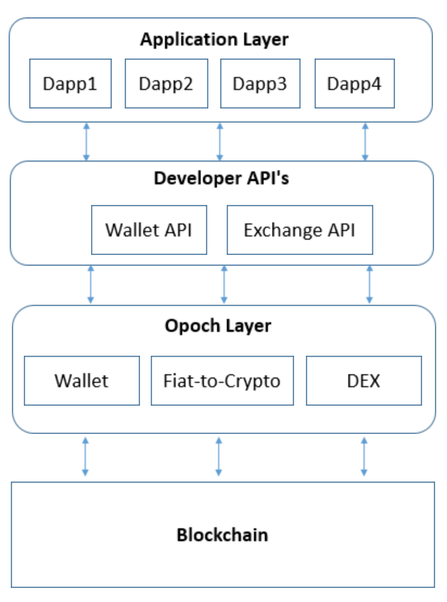

# Platform

We plan to open API's on Opoch for other developers and businesses. We will also provide white labeled solutions in form of SDK's, which will be a stripped down version of Opoch wallet with all it's functionalities, to the businesses so they can use Opoch Wallet in their technology stack. 

The biggest concern in this would be the security of user's assets as we are opening user's wallet to third party applications which might be malicious, we would like to mention MetaMask here as they have tackled the same problem very nicely over web \(browser\) by intimating user of any action done by the application and blocking certain functionalities to third parties. Security in blockchain is a major concern and `we are very aware of it at each step of development.`

Since community is the core of Opoch, we are building opoch in an open and modular way. ~~We could for example switch from using Kyber to 0x very easily because of our modular architecture~~. 

We will enable developers to not only build on top of Opoch but also use Opoch solutions in their own ecosystem. The vision is to allow developers to use opoch modules \(DEX, Wallet etc.\) to build their Dapps/apps which would be integrated into the Opoch app, after vetting from the community. 

We call this the Opoch Dapp layer, since each new application would have to solve the problems that we have solved while building OPOCH, we plan to provide easy API integration for the developers so that they can focus on their product/service and not worry about the underlying layers handled by Opoch.

* 
### Opoch Platform

Opoch also acts as a platform to build applications. An in-built DEX allows developers to think freely across cryptocurrencies, outside the box and create new markets that are non-existent in traditional payment methods. 

We do not consider ~~Information~~ _Opoch age_ to truly arrive, unless, everyone in the world is enabled to earn a living with the help of information that he creates for humanity. We talk in length on this in the next section, but its difficult to imagine a future where the underlying economic principles have been completely revamped.

~~A society driven by Agriculture looks fundamentally different than a society driven by Industries, and the true information age should blow our minds away. Unless, that's done we've work to do. It's too exciting to leave this far, and we must take bold forward strides today.~~

When we look at the _history of **Internet**_, it communicated 1% of Global telecommunication by 1993, 51% by 2000, and 97% by 2007. We know how it has shaped us as humanity. 

Web 3.0 is on a similar path, but the future does not build itself. _Today, crypto adoption is at less than 1%_.

So, for now, it’s vital to focus on growing adoption as it increases the overall value creation and unites crypto community as a whole towards the singular goal of creating a better future, together.

That's step one from here for the true information age, Opoch age. 

Join us in building this exciting future.

* ~~Firstly, _user holds his digital assets all the time_, unlike Centralised exchanges etc. which have multiple risks and are prone to failures.~~
* ~~Secondly, _private keys never touch the internet,_ unlike other wallets, Opoch makes sure private keys is something that an ordinary user never needs to worry about.~~
* ~~Thirdly, _holding multiple digital assets,_ Opoch's inbuilt wallet allows users to hold multiple cryptocurrencies like Bitcoin, Ethereum, etc. in the same app. This makes ordinary users worry less about the different blockchains and focus on utilising the applications.~~
* ~~Lastly, _recovery in cases of data theft, lost phone, etc._ Opoch is building a social recovery platform that allows you to recover your private keys in accidental cases. Yet, it's never possible to steal those private keys from the blockchain without your participation.~~

